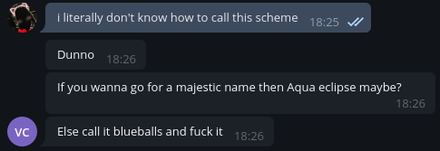
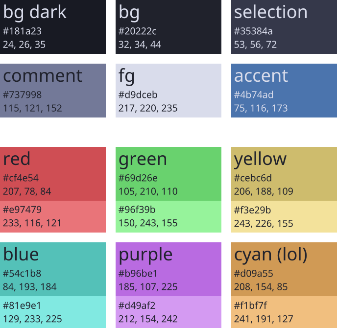
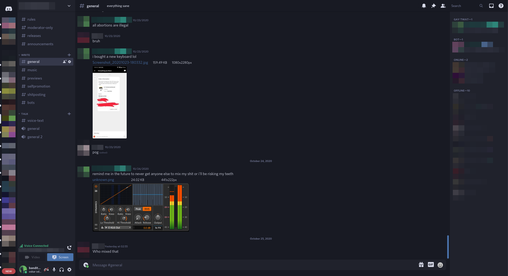

**blueballs** is a color scheme inspired by [Nord](https://www.nordtheme.com/) and [Dracula](https://www.nordtheme.com/). It's mostly intended for terminals and text editors but porting it everywhere possible is encouraged.

# Colors



The colors should be relatively self-explanatory but here are some notes for porting:

* **bg** is the main background color of your document/terminal and **bg dark** is a secondary background color used for additional UI elements such as headers and status bars.
* **selection** is the background of selected text.
* **comment** is used for comments in text files but can also be used as a secondary foreground color for unavailable/grayed-out elements.
* **fg** is the main foreground.
* **accent** is the accent color used for currently relevant UI elements. Use of this color can be very subjective.
* Other colors should only be used for syntax highlighting and specifically colored UI elements. "Cyan" is actually orange but we keep the original name terminals use.

When in doubt, use [blueballs.vim](https://github.com/bandithedoge/blueballs.vim) for reference. **Please do not change the colors** unless it's absolutely required and justified.

# Ports

Here are all blueballs ports I'm aware of for text editors and different software. **Contributions are welcome!**

If you want to add a port, use the following template and put it in the right category:

``` markdown
### [<program name>](<link to theme>)

<if your port is very short you can put a code block here>

* **Maintainer**: <your name>

#### Screenshot

<include a screenshot if you can>

#### Instructions

<short installation instructions, can be a link if more effort is required>
```

## Text editors

### [vim](https://github.com/bandithedoge/blueballs.vim)

* **Maintainer**: @bandithedoge

#### Screenshot


#### Instuctions

* [vim-plug](https://github.com/junegunn/vim-plug)
  * Add `Plug 'bandithedoge/blueballs.vim'` to your `.vimrc` and run `:PlugInstall`
  
## Music players

### [Spotify](https://github.com/morpheusthewhite/spicetify-themes/tree/master/Blueballs)

* **Maintainer**: @bandithedoge

#### Screenshot


#### Instructions

[Install spicetify](https://github.com/khanhas/spicetify-cli/wiki/Installation) and [spicetify-themes](https://github.com/khanhas/spicetify-cli/wiki/Installation)

## Other

### [Discord](https://github.com/bandithedoge/blueballs/blob/main/css/out/discord.css)

* **Maintainer**: @bandithedoge

#### Screenshot



#### Instructions

Install [BetterDiscord](https://github.com/bandithedoge/blueballs/blob/main/css/out/discord.css) and save the CSS file as `blueballs.theme.css` in your BetterDiscord config directory.

*This theme can also be used with other Discord CSS injectors or [Stylus](https://github.com/openstyles/stylus).*
